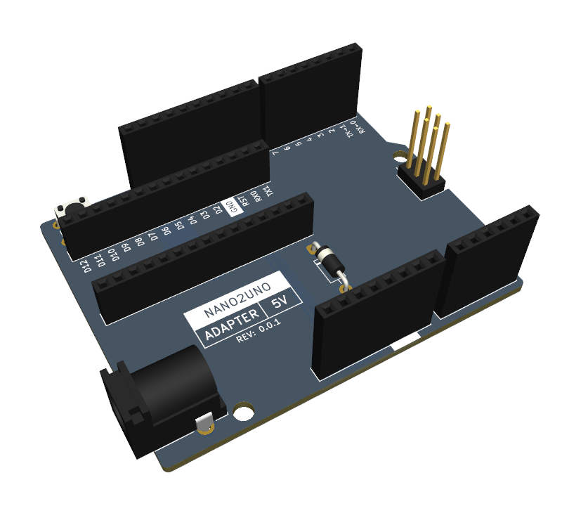

# Nano2UNO Adapter 5V

The Nano2UNO Adapter 5V is a circuit board to adapt 5V Arduino Nano boards the the Arduino UNO form factor.

All the IO pins on the Nano2UNO Adapter 5V are wired one to one from the Nano to the UNO form factor, no exceptions.
Pins A6 and A7 of the Nano are not connected because these pins are not present in the UNO form factor.

> [!NOTE]
> This design is distributed WITHOUT ANY EXPRESS OR IMPLIED WARRANTY, INCLUDING OF MERCHANTABILITY, SATISFACTORY QUALITY AND FITNESS FOR A PARTICULAR PURPOSE.

### Compatibility
The Nano2UNO Adapter 5V should, in theory, be compatible with the following Arduino Nano boards:
- [Arduino Nano](https://store.arduino.cc/collections/boards-modules/products/arduino-nano)
- [Arduino Nano Every](https://store.arduino.cc/collections/boards-modules/products/arduino-nano-every)

### Documentation
- [Schematic](Nano2UNO-Adapter-5V.pdf)
- [KiCAD Source Files](src)
- [STEP 3D Model](extras/Nano2UNO-Adapter-5V.step)

## Components

### Circuit Board
#### Specifications
- Board Length: __68.58mm__
- Board Width: __53.34mm__
- Board Thickness: __1.6mm__
- Substrate Material: __FR4__
- Copper Layers: __2__
- Copper Thickness: __1oz__
- Soldermask Color: __Any__ (Blue Suggested)
- Smallest Hole Diameter: __0.8mm__
- Smallest Trace Width: __0.2mm__ (7.8mil)
- Smallest Trace Spacing: __0.2mm__ (7.8mil)

#### Suppliers
Below are some circuit board manufacturers I have used in the past.
Generally you will need to upload the upload the [gerber and drill files](gerbers) to their websites in a .zip folder.

- [OSH Park](https://oshpark.com) is a US based circuit board fabrication service.
  They tend to be more expensive than other manufacturers and the number of options they give you are limited (If you use this manufacturer, I hope you like purple).

- [Seeed Studio Fusion](https://www.seeedstudio.com/fusion_pcb.html) makes circuit boards in China.
  They have a lot of options when ordering; please refer to the [specifications](#specifications) above when making your choices.
  They do have a circuit board assembly service as well, but I am not especially familiar with it.

### Purchase Components

| References | Quantity | Manufacturer | Part Number    | Description                     | Notes                                                                                  |
|------------|---------:|--------------|----------------|---------------------------------|----------------------------------------------------------------------------------------|
| D1         |        1 | Vishay       | SB260S-E3/54   | DO-41 Diode                     | This provides reverse voltage protection on the VIN pin and barrel jack.               |
| J1, J3     |        2 | Samtec       | ESW-108-33-L-S | 1x8 Socket Header               | These are extended socket headers that make up part of the Arduino UNO interface.      |
| J2         |        1 | Samtec       | ESW-110-33-L-S | 1x10 Socket Header              | This is an extended socket header that makes up part of the Arduino UNO interface.     |
| J4         |        1 | Samtec       | ESW-106-33-L-S | 1x6 Socket Header               | This is an extended socket header that makes up part of the Arduino UNO interface.     |
| J5, J6     |        2 | Sullins      | PPPC151LFBN-RC	| 1x15 Socket Header              | These are typical, 8.5mm tall, socket headers that make up the Arduino Nano interface. |
| J7         |        1 | TSW/Samtec   | TSW-103-15-L-D | 2x3 Pin Header                  | This is an extended pin header that makes up part of the Arduino UNO interface.        |
| J8         |        1 | CUI          | PJ-102A        | 2.0mm ID, 5.5mm OD Barrel Jack  | This is a pretty common barrel jack.                                                   |
| SW1        |        1 | TE           | 1825910-6      | 6mm Pushbutton Switch           | This is a generic 6mm pushbutton switch.                                               |

#### Suppliers
Below are some electronics suppliers I have used in the past:

- [Digi-Key](https://www.digikey.com/) is my usual go-to supplier for electronic components.
  Their website makes it pretty easy to sort through parts.

- [Mouser](https://www.mouser.com/) is very similar to Digi-Key in a lot of ways.
  They sometimes have better pricing, and they have excellent customer support.

- [Newark](https://www.newark.com/) tends to have a bit different selection than Digi-Key and Mouser, especially in the area of connectors.

- [Octopart](https://octopart.com/) is not a supplier per se; it is essenitally an electronic component search engine.
  This can be a very helpful tool when looking for parts, especially somewhat unusual ones, like extended socket headers.

All of these suppliers have a feature on their respective websites where you can upload a spreadsheet file, such as [Nano2UNO-Adapter-5V-BOM.csv](Nano2UNO-Adapter-5V-BOM.csv), to populate the cart or find parts.

Last I checked, it is not possible to order all the components needed to build a Nano2UNO Adapter 5V from just one of these suppliers. Multiple orders will be needed.

## Assembly

### Tools and Supplies
| Item              | Optional | Notes                                                                                                                                              |
|-------------------|----------|----------------------------------------------------------------------------------------------------------------------------------------------------|
| Soldering Iron    | No       | Make sure you use a good quality soldering iron. A poor quality soldering iron will give you a miserable soldering experience.                     |
| Flush Cutters     | No       | These are used to trim component leads.                                                                                                            |
| Flux Core Solder  | No       | Leaded solder is easier to work with, but lead-free solder is better for the environment.                                                          |
| Solder Flux       | Yes      | Extra flux will make the solder flow better. I don't usually use it when through-hole soldering, but it can be helpful.                            |
| Solder Wick       | Yes      | This is used to remove solder from places you don't want it.                                                                                       |
| Solder Sucker     | Yes      | If you need to de-solder a component, this, along with solder wick, is the tool you want. This can quickly remove most of the solder from a joint. |
| Arduino Shield    | Yes      | This can be used to hold the stacking socket headers in place while being assembled.                                                               |
| Isopropyl Alcohol | Maybe    | This is used to remove flux. It is not needed if you are using no-clean flux.                                                                      |
| Dish Soap         | Maybe    | This is used to remove flux residue. It is not needed if you are using no-clean flux.                                                              |

> **Note on Flux**  
> Traditional flux if left on the assembled circuit board could cause some serious issues.
> It can potentially cause shorts or significant [parasitic capacitance](https://en.wikipedia.org/wiki/Parasitic_capacitance).
> It is also somewhat corrosive and can, over time, damage your circuit board.
> This sort of flux must be cleaned off the board after assembly.
> 
> To address these issues there are no-clean fluxes, that can be left on the circuit board assembly and are unlikly to cause these issues.
> There are also water-soluble fluxes that can be cleaned off with hot water, though I have found that some isopropyl alcohol can speed up the process.
> There are also fluxes that are both no-clean and water soluble; this is what I like to use.

### Assembly Steps
All the components are placed on the front side of the board and solderd on the back side of the board.
These steps go through soldering each component, starting with the shortest.

> The [interactive HTML BOM](https://github.com/CMB27/Nano2UNO-Adapter-5V/blob/main/extras/Nano2UNO-Adapter-5V-interactive-BOM.html) may be helpful to you in this process.
> It graphically shows where each component goes on the board.
> You will need to download it in order to view it; GitHub does not render HTML files in repositories.

#### 1. D1 (Diode)
- Bend the diode leads so that the part will fit in the footprint.
- Place the diode, ensuring that the side with the line closest to it (the cathode) is facing the squarish pad.
- Bend the diode leads on the backside of the board to ensure the diode remains in place when soldering.
- Solder the leads to the pads.
- Trim the leads using flush cutters.

#### 2. SW1 (Pushbutton Switch)
- Place the switch; it should stay in place.
- Solder the leads to the board.

#### 3. J5-J6 (Arduino Nano Socket)
- If you have an Arduino Nano board, place the socket headers on the Nano's pins, then place the socket header pins through the holes on the Nano2UNO circuit board.
  This will ensure your Nano board will line up with the sockets once they are soldered in place.
  If you do not have an Arduino Nano board on hand, place the socket header pins as precisely as you can.
- Carefully flip the board over the board, holding the socket headers in place.
  This can be difficult; it may be necessary to solder each socket header one at a time.
- Tack solder the end pins of the socket headers.
- Check that the socket headers are straight and seated correctly.
  If necessary remelt the solder joints to adjust the socket headers. (This is where flux can be nice.)
- Once the headers are straight, solder the remaining pins. I usually go every other pin to avoid heat build up, then go back soldering the pins I skipped.
- If you used an Arduino Nano board to place the sockets, remove it now.

#### 4. J8 (Barrel Jack)
- Place the barrel Jack.
- Tack solder the pin near the middle of the component.
- Check that the part is straight and seated correctly.
- Solder the remaining pins.

#### 5. J7 (ICSP Header)
- Place the pin header.
- Tack solder one pin. I like to solder one of the corners.
  Be careful when soldering this component; it has a lot of exposed metal that can burn you when heated by a soldering iron.
- Check that the part is straight and seated correctly.
- Solder the remaining pins.

#### 6. J1-J4 (Arduino UNO Interface)
- If you have a shield for the Arduino UNO, place the socket headers on its pins, then place the socket header pins through the holes on the Nano2UNO circuit board.
  This will make it easier and faster to install the sockets.
  If you don't have a shield you will likely need to install the sockets one at a time.
- Carefully flip the board over the board, holding the socket headers in place.
- Tack solder the end pins of the socket headers.
- Check that the socket headers are straight and seated correctly.
- Once the headers are straight, solder the remaining pins.
- If you used a shield, remove it now.

#### 7. Clean Flux Off Board  
_If you used no-clean flux, you can skip this step._

> [!NOTE]
> This step was written with water-soluble flux in mind.  
> If you used non-water-soluble flux, you may need to use a different cleaning process.

- Use isopropyl alcohol with a toothbrush to remove the bulk of the flux.
- Clean the board with dish soap and warm water using the same toothbrush.
- Dry the board thoroughly. I like to use compressed air for this step.
