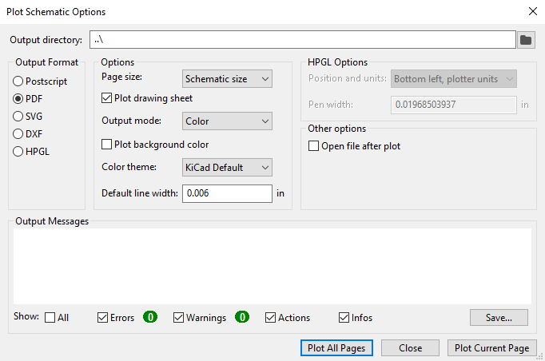
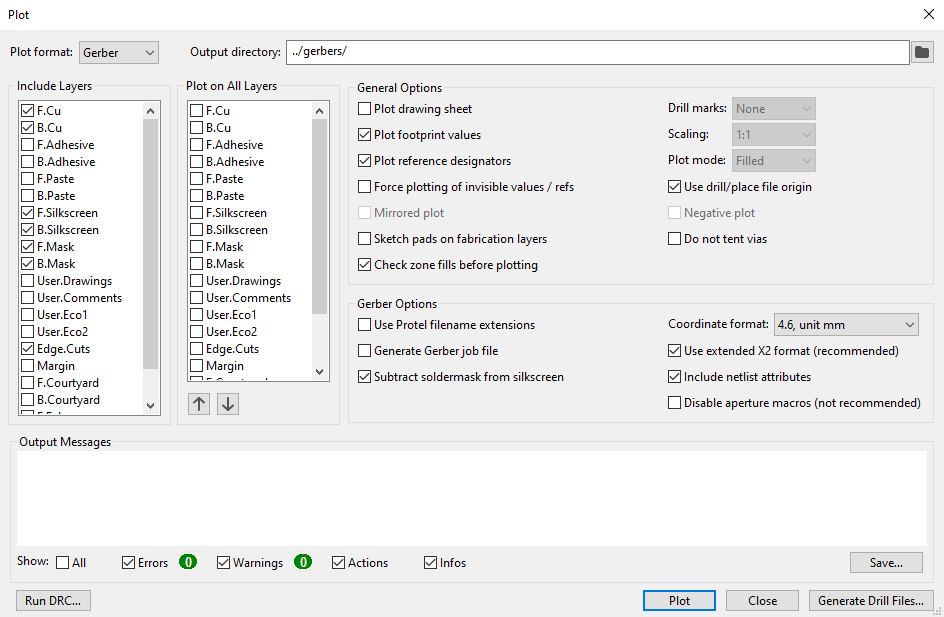
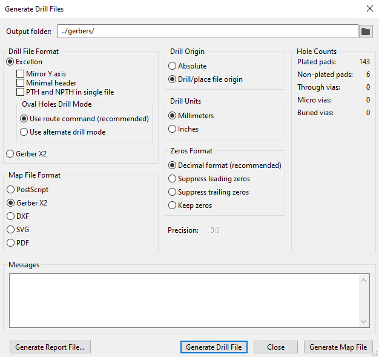
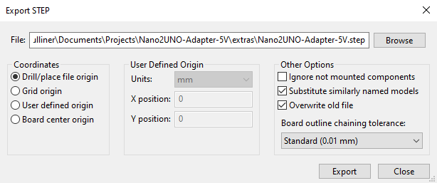

# Production File Creation Steps
These steps are for use with the [Nano2UNO Adapter 3V3 source files](https://github.com/CMB27/Nano2UNO-Adapter-5V/tree/main/src).

## Schematic Editor

### Check Date and Revision
- Click on the `Settings for paper size and title block info` button or `File/Page Settings...`
- In the `Page Settings` window:
  - Click on the `<<<` button to set the `Issue Date` to the current date
  - Make sure the `Revision` is set correctly
  - Click `OK`

### Generate PDF of Schematic
- Click on the `Plot` button or `File/Plot...`
- In the `Plot Schematic Options` window:  
  
  - Set the output directory to `../` or in Windows `..\`
  - Set the output format to `PDF`
  - In `Options`:
    - Set the `Page size` to `Schematic size`
    - Make sure the box to `Plot drawing sheet` is checked
    - Set the `Output mode` to `Color`
    - Make sure the box to `Plot background color` is not checked
    - Set the `Color theme` to `KiCad Default`
    - Set the `Default line width` to `0.006in` or `0.1524mm`
  - In `Other options`, make sure the box to `Open file after plot` is not checked
  - Click `Plot Current Page`
  - Click `Close`

## PCB Editor

### Check Date and Revision
- Click on the `Settings for paper size and title block info` button or `File/Page Settings...`
- In the `Page Settings` window:
  - Click on the `<<<` button to set the `Issue Date` to the current date
  - Make sure the `Revision` is set correctly
  - Click `OK`

### Generate Gerber and Drill Files
- Click on the `Plot` button or `File/Plot...`
- In the `Plot` window:  
  
  - Set `Plot Format` to `Gerber`
  - Set `Output directory` to `../gerbers/`
  - In `Include Layers`, make sure only the following boxes checked:
    - `F.Cu`
    - `B.Bu`
    - `F.Silkscreen`
    - `B.Silkscreen`
    - `F.Mask`
    - `B.Mask`
    - `Edge.Cuts`
  - In `Plot on All Layers`, make sure none of the boxes are checked
  - In `General Options`, make sure only the following boxes are checked:
    - `Plot footprint values`
    - `Plot reference designators`
    - `Check zone fills before plotting`
    - `Use drill/place file origin`
  - In `Gerber Options`:
    - Set `Coordinate format` to `4.6, unit mm`
    - Make sure only the following boxes are checked:
      - `Subtract soldermask from silkscreen`
      - `Use extended X2 format`
      - `Include netlist attributes`
  - Click `Plot`
  - Click `Generate Drill Files...`
  - In the `Generate Drill Files` window:  
    
    - Set `Output folder` to `../gerbers/`
    - In `Drill File Format`:
      - Select `Excellon`
      - Make sure none of the boxes are checked
      - In `Oval Holes Drill Mode`, select `Use route command`
    - In `Drill Origin`, select `Drill/place file origin`
    - In `Drill Units`, select `Millimeters`
    - In `Zeros Format`, select `Decimal format`
    - Click `Generate Drill File`
    - Click `Close`
  - Click `Close`

### Generate STEP File
- Click `File/Export/STEP...`
- In the `Export STEP` window:  
  
  - Set `File` to `../extras/Nano2Uno-Adapter-5V.step`
  - In `Coordinates`, select `Drill/place file origin`
  - In `Other Options`:
    - Make sure only the following boxes are checked:
      - `Substitute similarly named models`
      - `Overwrite old file`
    - Set `Board outline chaining tolerance` to `Standard (0.01mm)`
  - Click `Export`
  - In the `STEP Export` window, once the export has completed, click `OK`

### Generate Interactive HTML BOM
- Click on the `Generate Interactive HTML BOM` button
- The appropriate settings should automatically load
- Click `Generate BOM`
